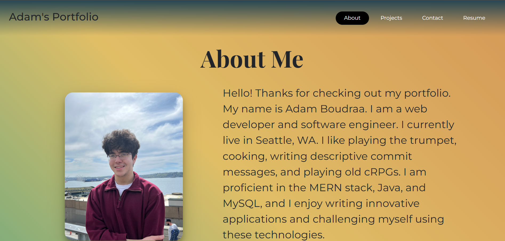

# Boudraa-Portfolio-Page

## Description
This website is a single page application built using React. It contains an about me section, a brief list of my projects, a form for getting in touch with me, as well as a link to download my resume.

Link to deployed site:
https://poetic-pasca-394afb.netlify.app/

## Table of Contents

- [License](#license)

- [Questions](#questions)

## License
This project is licensed under the terms of the MIT License.

## Questions

GitHub: https://github.com/adamboudruh.

Please direct any questions to my email: [adamboudraa@gmail.com](mailto:adamboudraa@gmail.com).

    